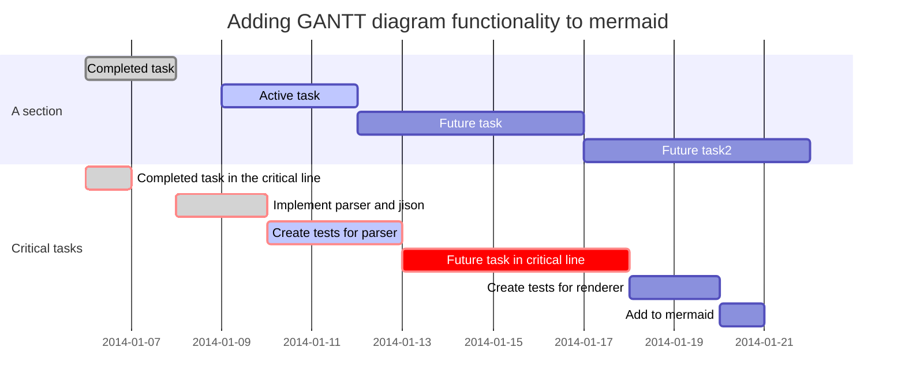
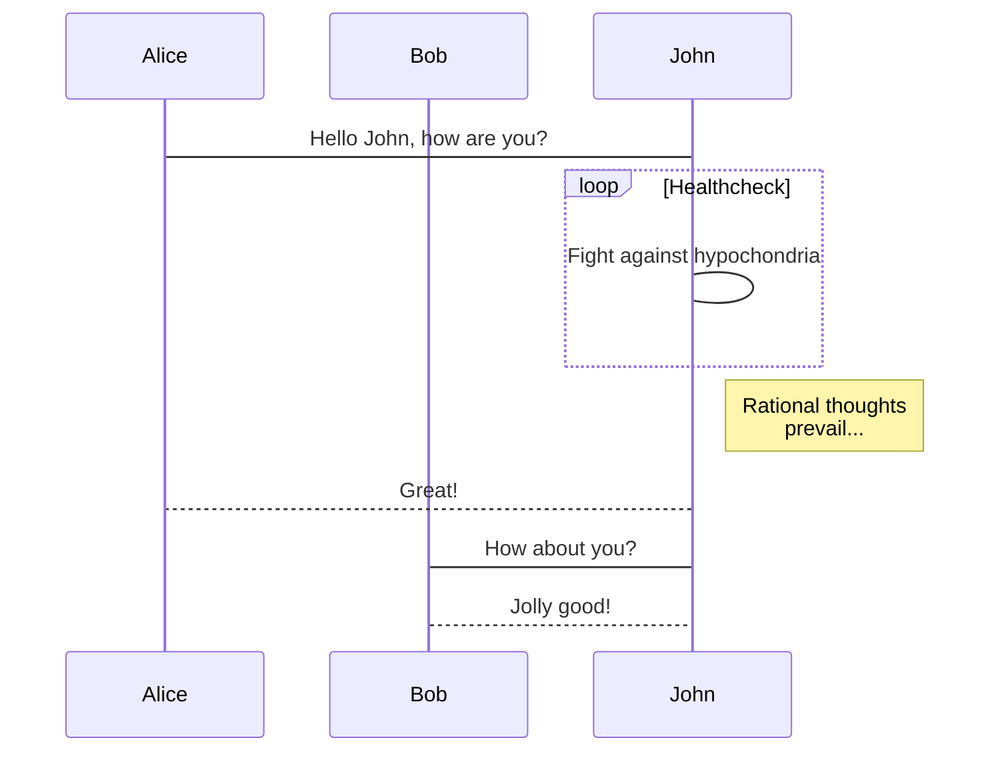

<link type="text/css" rel="stylesheet" href="./css/mark.css">

# 마크다운 문법 정리
Markdown파일을 작성하기 위해 [MarkdownGuide](https://developers.google.com/web/resources/markdown-syntax) 사이트와 
[GitLab Markdown 사용가이드](https://docs.gitlab.com/ee/user/markdown.html)를 참고하여 주로사용될 문법위주로 정리하였습니다. 


## Headings
마크다운에서 기본적으로 html태그에서 지원하는 **h1~h6의 태그**를 **`#의 갯수`** 에 따라 h1~h6과 동일한 내용으로 지원해 줍니다.

| 문법                    | 츨력                       |
| --------------------- | ------------------------ |
| # Header 1 : #1개      | <h1> Header 1 : #1개</h1> |
| ## Header 2 : #2개     | <h2> Header 2 : #2개</h2> |
| ### Header 3 : #3개    | <h3> Header 3 : #3개</h3> |
| #### Header 4 : #4개   | <h4> Header 4 : #4개</h4> |
| ##### Header 5 : #5개  | <h5> Header 5 : #5개</h5> |
| ###### Header 6 : #6개 | <h6> Header 6 : #6개</h6> |


## 목록
아직 마크다운의 문법에 표준이 정확하지 않습니다. 통일해서 작성을 하는게 좋을 것 같아서  
<u>**순서가없는 목록**</u>은 **`-`** 로 통일해서 작성하고, <u>**순서가 있는 목록**</u>은 작성하실 때 순차적인 시퀀스로 작성합니다.   
예를들면  **`1. 내용1 2. 내용2 3. 내용3`** 으로 작성합니다.


-   ### 순서가 없는 목록  
| 문법                         | 츨력                                           |
|----------------------------|----------------------------------------------|
| - 대쉬 <br> - 대쉬2            | <ul><li>대쉬</li><li>대쉬2</li></ul>             |
| * 별표 <br> * 별표2            | <ul><li>별표</li><li>뱔표2</li></ul>             |
| + 혼합 <br> * 혼합2 <br> - 혼합3 | <ul><li>혼합</li><li>혼합2</li><li>혼합3</li></ul> |


-   ### 순서가 있는 목록 
| 문법                                                                                                   | 츨력                                                                                 |
|------------------------------------------------------------------------------------------------------|------------------------------------------------------------------------------------|
| 1. 내용1 <br> 2. 내용2                                                                                   | <ol><li>내용1</li><li>내용2</li></ol>                                                  |
| 1. 내용1 <br> 1. 내용2                                                                                   | <ol><li>내용1</li><li>내용2</li></ol>                                                  |
| 1. 내용1 <br> 5. 내용2 <br> 2. 내용3                                                                       | <ol><li>내용1</li><li>내용2</li><li>내용3</li></ol>                                      |
| 1. 내용1 <br> 2. 내용2 <br> &nbsp; &nbsp; &nbsp; 1. 내용2-1 <br> &nbsp; &nbsp; &nbsp; 2. 내용2-2 <br> 3. 내용3 | <ol><li>내용1</li><li>내용2</li><ol><li>내용2-1</li><li>내용2-2</li></ol><li>내용3</li></ol> |


## TODO 
일반적으로 알고 계시는 TODO 관련 문법입니다. 체크와 미체크로 나뉘어지며  
`[x]는 체크`를 의미하고, `[ ]는 미체크`를 의미합니다.

| 문법                                            | 츨력                                                                                                              |
|-----------------------------------------------|-----------------------------------------------------------------------------------------------------------------|
| - [x] 아침 먹기 <br> - [ ] 점심 먹기 <br> - [ ] 저녁 먹기 | <input type="checkbox" checked=true/>아침 먹기<br> <input type="checkbox"/>점심 먹기 <br> <input type="checkbox"/>저녁 먹기 |

<div class="note">
<strong>Note: </strong>
<span> [ ]는 => []안에 스페이스(공간) 한개가 있어야 합니다. </span>
</div>


## 굵기
Bold `__`와 `**`를 **글씨에 앞 뒤 넣어서** 글에서 강조를 하기위해 사용 합니다.
대부분 플러그인에서는 `**`를 주로 **사용하므로** `**`를 사용합니다.

문법          | 출력
------------|-----------------------
`**안녕하세요**` | <strong>안녕하세요</strong>
`__안녕하세요__` | <strong>안녕하세요</strong>
`안**녕하**세요` | 안<strong>녕하</strong>세요


## 이탤릭체
이탤릭체 `_`와 `*`를 **글씨에 앞 뒤 넣어서** 글에서 기울임을 표시 하기위해 사용 합니다.


문법          | 출력
------------|-----------------------
`*안녕하세요*` | <em>안녕하세요</em>
`_안녕하세요_` | <em>안녕하세요</em>
`안_**녕하**_세요` | 안<em><strong>녕하</strong></em>세요

## 밑줄 및 취소선
`취소선`은 `~~`를 앞뒤로 앞뒤로 붙여서 사용 합니다. `밑줄`은 **md 기본문법에서 지원하지 않고 있습니다.**  
따라서 GitLab에서 보이진 않지만 차후 출력을 위해 **HTML or PDF로 변환시 적용**하기 위해   
`<u>태그`를 사용하여 나타낼 수 있습니다.

문법               | 출력
---------------   |-------------
`~~취소선입니다~~`   | ~~취소선입니다~~
`<u>밑줄입니다</u>`  | <u>밑줄입니다</u>


## 링크
HTML의 `a태그` 와 동일한 기능을 하며, 간편하게 사용할 수 있습니다.  
`[제목](경로)` 로 작성을 합니다.


- ### 사용법
  ```
  [구글](https://www.google.com)
  [네이버](https://www.naver.com)
  <http://www.naver.com>
  <abc@naver.com>
  [헤드링크](#헤더내용)

  ```
- ### 출력결과
  [구글](https://www.google.com)  
  [네이버](https://www.naver.com)  
  <http://www.naver.com>  
  <abc@naver.com>  
  [헤더링크](#링크)  


<!-- ## 참조링크

```
[참조링크][1]
[1]: http://www.naver.com   -> 1이란

```

[참조링크][1]
[1] : http://www.naver.com -->


## 각주 
각주는 플러그인을 통해 **MarkDown 파일**을 <u>**HTML 이나 PDF로 변환할 때 적용되지 않고 있습니다.**</u>
GitLab에서는 적용되고 있고, MarkDown 기본문법에 해당하므로 적절히 사용하면 될 것 **같습니다.**

- ### 사용법
  ```
  * 사용법
  이미지[^1] 내용확인
  네이버주소[^2] 내용확인

  * 각주 정의
  [^1]: 이미지란 그림이다     
  [^2]: 네이버주소는 다음 주소 입니다 http://www.naver.com    
  ```

- ### 출력결과
  이미지[^1] 내용확인  
  네이버주소[^2] 내용확인

  [^1]: 이미지란 그림이다     
  [^2]: 네이버주소는 다음 주소 입니다 http://www.naver.com


## 이미지
HTML의 `img태그`와 동일하며, 이미지를 삽입할 수 있고, 이미지에 링크를 설정할 수 있습니다.

- ### 사용법
  ```
  이미지 : 
    -> 
  이미지 링크 : `[](이동할링크)` 
    -> [](https://about.gitlab.com/)

  ```
- ### 출력결과
  #### 이미지 :  
  #### 이미지링크 : [](https://about.gitlab.com/)


## 인용
글에서 인용구문을 통해 인용문을 보여줄 수 있습니다.

- ### 사용법
  ```
  > 인용
  >> 중첩인용  
  >> 안녕하세요  
  >> 봉쥬르
  >>> 반갑습니다  
  >>> 반가워요~
  ```
  
- ### 출력결과
> 인용
>> 중첩인용  
>> 안녕하세요  
>> 봉쥬르
>>> 반갑습니다  
>>> 반가워요~  

## 테이블(표)
- 셀 구분 : `- (dash)를 3개 이상 나열`  
- `: 기호로 정렬 가능`
- `<br/>`을 사용하면 개행을 할 수 있습니다.

- ### 사용법
  ```
  | 왼쪽정렬         | 가운데정렬         | 오른쪽정렬 |
  |:---------------|:---------------:|-------:|
  | column 3 is   | right-aligned | $100  |
  | column 2 is   | centered<br/>Hi      | $10   |
  | zebra stripes | are neat      | $1    |
  ```

- ### 출력결과
| 왼쪽정렬        |     가운데정렬   | 오른쪽정렬 |
|:--------------|:-------------:|------:|
| column 3 is   | right-aligned |  $100 |
| column 2 is   |   centered<br/>Hi    |   $10 |
| zebra stripes |   are neat    |    $1 |


## 그외 기능
`<b>`태그는 css파일(mark.css)에 **빨간글씨**가 출력되게 미리 정의를 해놨습니다. 즉 css에 의해 적용되는 부분이어서 GitLab에서는 
**볼드체(굵음)** 로 표시됩니다. 즉 **HTML or PDF로 출력시에 적용**되어 나타나게 됩니다.  
또한 **태그에 스타일을 직접 적용**하면 파일변환 및 yona에는 적용되지만 **GitLab 웹상에서 적용이 되지 않습니다.**

| 기능            | 사용법         |
|---------------|-------------|
| 개행            | `빈칸2개`      |
| 선긋기           | `---3개이상`   |
| 왼쪽꺽쇠          | `&lt;< `    |
| 오른쪽꺽쇠         | `&gt;>`     |
| <b>빨간글씨</b>   | `<b>빨간글씨</b>` 
|<span style="color:blue;">직접적용</span> | `<span style="color:blue;">직접적용</span>`


<div class="caution">
<strong>Caution:</strong>
<span> b태그는 css를 통해 빨간글씨가 나오도록 되어있습니다. 따라서 기본 md문법에서는 적용이 안되며, 차후 HTML이나 PDF로 변환시 적용됩니다. </span>
</div>


## 이스케이프
백 슬래시(`\`)를 사용하여 다음 문자를 이스케이프 할 수 있습니다.

|캐릭터 | 이름
|------- | -------
|\\ | 백 슬래시
|\` | 백틱
|\* | 별표
|\_ | 밑줄
|\{\} | 중괄호
|\[\] | 괄호
|\(\) | 괄호
|\# | 샾
|\+ | 더하기 부호
|\- | 마이너스 기호 (하이픈)
|\. | 점
|\! | 느낌표


## 코드블럭
코드블럭은 **` ``` `** 로 감싸서 다양한 환경의 스타일을 제공 해줍니다.  
**` ```java ``` `** 으로 설정하면 적절한 스타일을 만들어 줍니다.

- #### 사용법
```
    ```
    텍스트 로 내용을 작성합니다.
    텍스트 로 내용을 작성합니다.
    텍스트 로 내용을 작성합니다.
    텍스트 로 내용을 작성합니다.
    텍스트 로 내용을 작성합니다.
    텍스트 로 내용을 작성합니다.
    ```
```
- #### 출력결과
```
    텍스트 로 내용을 작성합니다.
    텍스트 로 내용을 작성합니다.
    텍스트 로 내용을 작성합니다.
    텍스트 로 내용을 작성합니다.
    텍스트 로 내용을 작성합니다.
    텍스트 로 내용을 작성합니다.
```

- #### Java
```
    ```java
    import java.util.*;
    public class TestClass{
        private String name;
        public final static UTF-8 = "UTF-8";
        public void testMethod(){
            System.out.println("코드블럭 백틱3개씩");
        }
    }
    ```
```

- #### Java 렌더링
```java
import java.util.*;
public class TestClass{
    private String name;
    public final static UTF-8 = "UTF-8";
    public void testMethod(){
        System.out.println("코드블럭 백틱3개씩");
    }
}
```

- #### JavaScript
```
    ```javascript
    let a = fucntion (){
        console.log("코드블럭");
    }

    function syntaxHighlighting() {
      let n = 33;
      const s = "hello, 안녕하세요~!!!";
      console.log(s);
    }
    ```
```
- #### JavaScript 렌더링
```javascript
let a = fucntion (){
    console.log("코드블럭");
}

function syntaxHighlighting() {
  let n = 33;
  const s = "hello, 안녕하세요~!!!";
  console.log(s);
}
```

- #### html
```html
<a href="https://www.google.co.kr/" target="">GOOGLE</a>
```

- #### css
```css
.list > ul {
  position: absolute;
  top: 30px;
  size : 50%;
}
```

- #### bash
```bash
$ vim ./~zshrc
```

- #### python
```python
s = "Python"
print(s)
```

- #### c
```c
#include <stdio.h>
int main(void)
    printf(%s,"C언어");
    return 0;
}
```

- #### json
```json
{
  "firstName": "John",
  "lastName": "Smith",
  "age": 25
}
```

- #### mermaid







#### [mermaid참고](https://mermaidjs.github.io/)
  - md에서는 지원되는 내용이라 참고사항으로 링크를 걸었습니다. 
  - **HTML이나 PDF로 변환시에는 지원되지 않습니다.**


